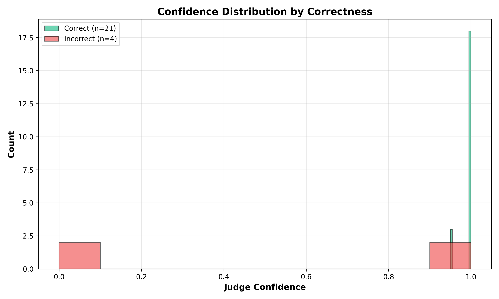
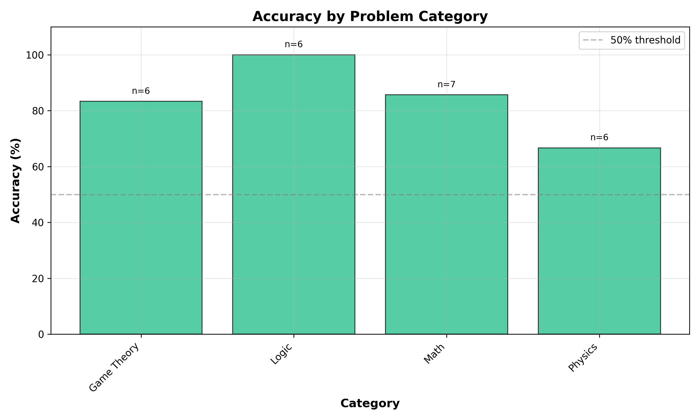
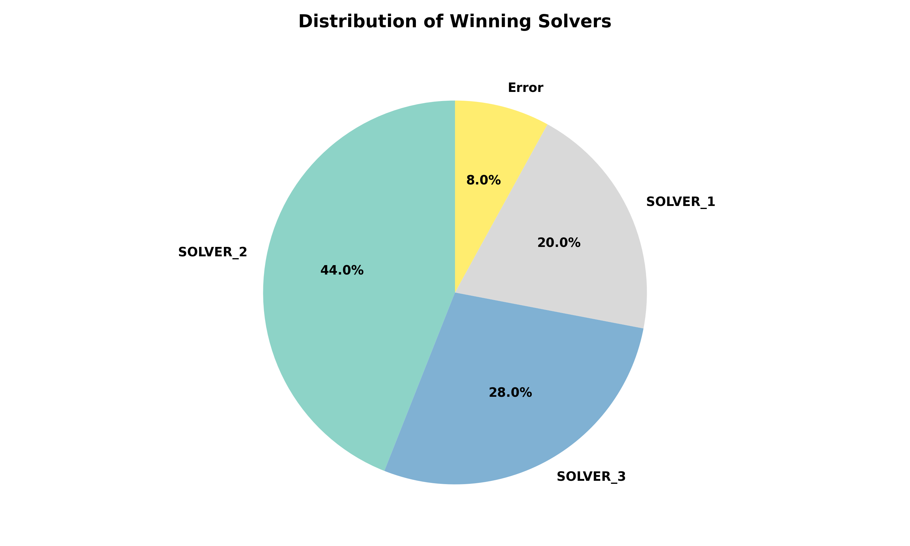
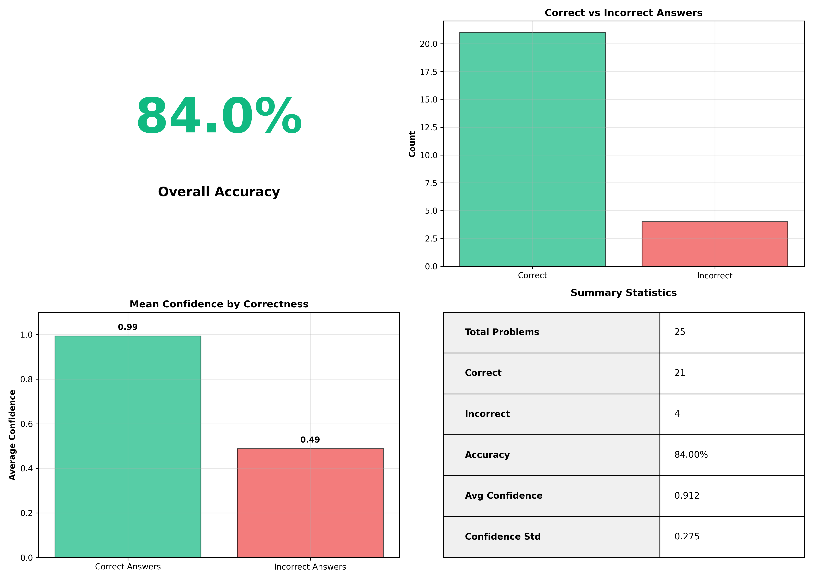

# Gemini Multi-Agent Debate System

This project is an experimental setup to see how multiple LLMs (using Google Gemini) can work together to solve complex math and logic problems. Instead of just asking one AI, we let them debate, review each other's work, and come to a final "judged" conclusion.

## Project Aims
* **Self-Selection:** Agents look at a problem and decide who should be the "Manager" (Judge) and who should be the "Solvers."
* **Structured Reasoning:** Forcing the LLMs to use strict JSON schemas (via Pydantic) so the data is actually usable.
* **Debate & Refinement:** Solvers propose solutions, others peer-review them, and the Judge picks the best answer.
* **Accuracy Tracking:** Scripts to run multiple problems and plot the success rate automatically.

---

## System Architecture

### Roles
The system assigns **four distinct roles** to agents:

* **Three Solver Roles** with unique personas:
  - **First-Principles Thinker:** Breaks problems into basic logical components and builds solutions from the ground up, avoiding assumptions
  - **Skeptical Critic:** Assumes hidden traps or common misconceptions, looks for edge cases and verifies calculations twice
  - **Creative Strategist:** Seeks elegant shortcuts, symmetries, or unconventional logical paths while maintaining strict mathematical rigor

* **One Judge:** Evaluates all final solutions objectively and selects the best answer

### Five-Stage Debate Process

**Stage 0: Self-Assessment and Role Assignment**
- Each agent evaluates their confidence for solving vs. judging the specific problem
- Highest judge-confidence agent becomes Judge
- Remaining three become Solvers, ranked by solver-confidence

**Stage 1: Independent Solution Generation**
- Each Solver generates their solution independently using their assigned persona
- No communication between Solvers at this stage

**Stage 2: Peer Review**
- Each Solver critically reviews the other two Solvers' solutions
- Reviews identify strengths, weaknesses, errors, and suggest improvements

**Stage 3: Solution Refinement**
- Solvers receive peer feedback and decide whether to accept or reject critiques
- Must justify their decisions and update solutions accordingly

**Stage 4: Final Judgment**
- Judge reviews all original solutions, peer reviews, and refined solutions
- Selects the best final answer based on correctness, reasoning quality, and how well critiques were addressed

### Why Personas Matter

**Personas encourage cognitive diversity.** A skeptical critic looks for edge cases, while a first-principles thinker builds from fundamentals. This prevents groupthink and catches errors that a single perspective might miss. Different reasoning approaches provide complementary strengths and help identify blind spots in each other's solutions.

---

## Folder Structure
```text
llm-systems-project/
├── data/               # JSON results and evaluation logs
├── plots/              # Generated accuracy graphs
├── scripts/
│   ├── evaluate_results.py  # Runs the 25-problem test bench
├── src/
│   ├── agents/
│   │   └── gemini_agent.py  # Gemini API wrapper with retry logic
│   ├── core/
│   │   ├── orchestrator.py  # The "brain" that manages the debate stages
│   │   └── schemas.py       # Pydantic models 
│   └── __init__.py
├── main.py             # Entry point for a single test run
└── requirements.txt   
```

---

## Installation

1. **Clone the repository:**
```bash
   git clone https://github.com/SandroSh/multi-llm-debate-system.git
   cd multi-llm-debate-system
```

2. **Create a virtual environment:**
```bash
   python -m venv .venv
   .venv\Scripts\activate
```

3. **Install dependencies:**
```bash
   pip install -r requirements.txt
```

4. **Set up API key:**
   Create a `.env` file in the project root:
```
   GEMINI_API_KEY=your_api_key_here
```

---

## Usage

### Run a Single Problem
```bash
python main.py
```

### Run Full Evaluation
```bash
python scripts/evaluate_results.py
```

This will:
- Process all problems in `data/input_problems.json`
- Generate results in `data/results_raw.json`
- Create visualization plots in `plots/` directory

---

## Results & Visualizations

### Confidence Distribution

*Judge confidence levels for correct vs incorrect answers*

### Accuracy by Category

*Performance breakdown across different problem types*

### Winner Distribution





### Key Findings
- **System Reliability:** 92% completion rate (8% errors)
- **High Confidence Alignment:** Judge confidence of 0.91 average correlates well with correctness
- **Best Persona:** Skeptical Critic (Solver_2) wins most often, suggesting careful verification helps

---

## Technical Details

### Temperature Settings
- **0.1** for role assessment (deterministic)
- **0.7** for solution generation (creative)
- **0.3** for refinement (balanced)
- **0.2** for judgment (objective)

### Error Handling
- Try-catch blocks at each stage with fallback mechanisms
- Failed refinements use original solutions
- Failed judgments select highest-confidence solver

### API Usage
- ~14 API calls per problem (4 assessments + 3 solutions + 6 reviews + 3 refinements + 1 judgment)
- Retry logic with exponential backoff for transient failures

---

## Limitations

1. **Shared Knowledge Gaps:** If all agents lack domain knowledge, peer review won't catch errors
2. **Computational Cost:** Multiple API calls per problem
3. **Error Rate:** 8% system failures mostly from json parse(my fault)  or it can be  API issues

---

## Future Improvements

- Add web search integration for factual queries
- Implement confidence calibration
- Use different LLM models for different roles
- Add retry logic to reduce error rate
- Expand to more diverse problem types

---

## Acknowledgments

Built using Google Gemini API and structured with Pydantic schemas for reliable multi-agent coordination.